<p align="center">
  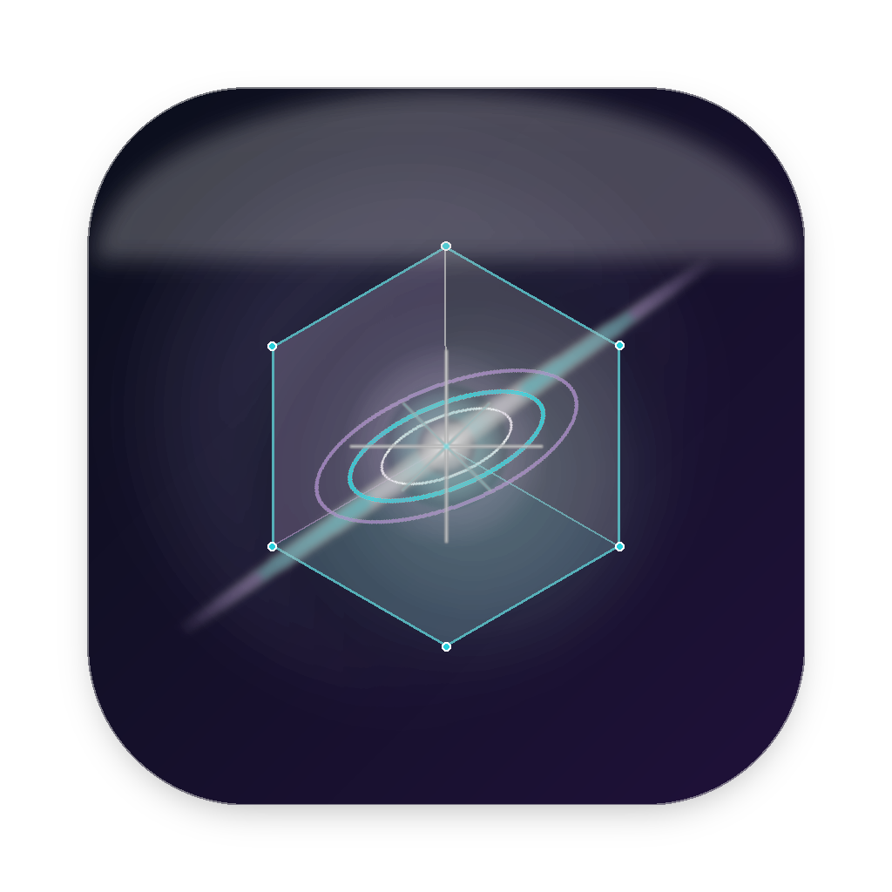
</p>

# <div align="center">🌌 PULSAR</div>
<div align="center"><strong>Next-Generation macOS Archive & Data Compression Ecosystem</strong></div>
<div align="center"><em>Light-Speed Performance Powered by Apple Silicon, Native 7-Zip & WinRAR Engines</em></div>

<br>

<div align="center">

[](https://apple.com)
[-cyan?style=for-the-badge)](https://apple.com)
[-8B5CF6?style=for-the-badge)](CHANGELOG.md)
[](LICENSE)

</div>

> A high-performance, space-themed archive manager for macOS powered by native Apple Silicon 7-Zip & WinRAR engines. Supports 7z, RAR, ZIP, TAR, GZ, XZ, ISO, DMG, and more with 3 layout modes, dynamic system themes, and zero dependencies.

---

## 🖥️ Screen Showcase & Visual Tour

Pulsar strictly adheres to **Apple Human Interface Guidelines (HIG)**, featuring dynamic Light & Dark mode adaptation, native macOS Finder file/folder icons, and clean grouped form card architecture.

### 🌓 Dynamic System Themes: Dark Mode & Light Mode

| Dark Mode (macOS Ventura / Sonoma / Sequoia) | Light Mode (macOS Ventura / Sonoma / Sequoia) |
| :---: | :---: |
| 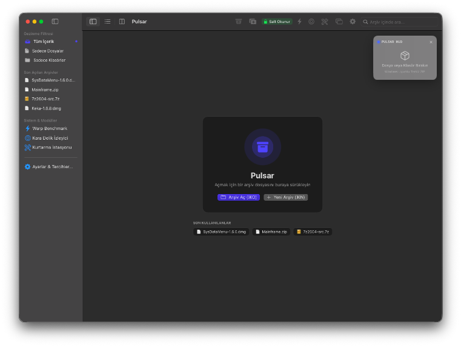 | 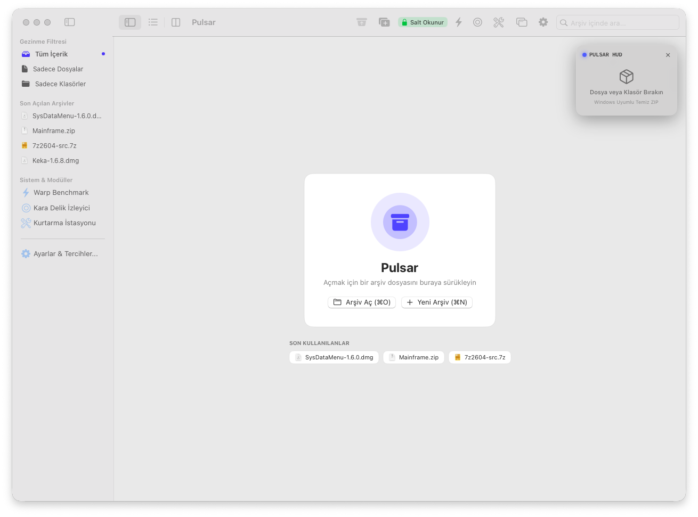 |
| **Empty State Hero (Dark Mode)** | **Empty State Hero (Light Mode)** |

### 📂 3-Pane Archive Browser & Inspector (`⌘1`)

| Dark Mode Browser & Inspector | Light Mode Browser & Inspector |
| :---: | :---: |
| 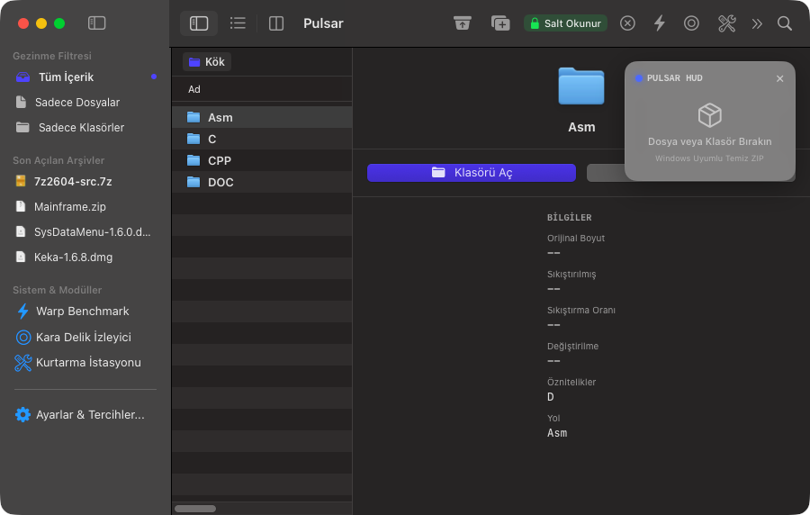 | 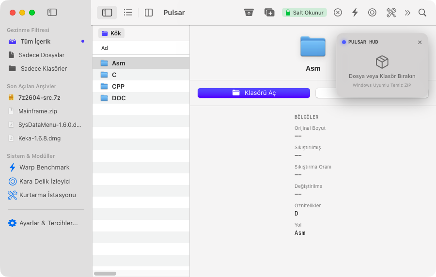 |
| **Virtual Directory Synthesis, Native Finder Icons & Inspector** | **Clean Light Appearance with QuickLook Preview** |

### 📑 Compact List Layout (`⌘2`)

| Compact List (Dark) | Compact List (Light) |
| :---: | :---: |
| 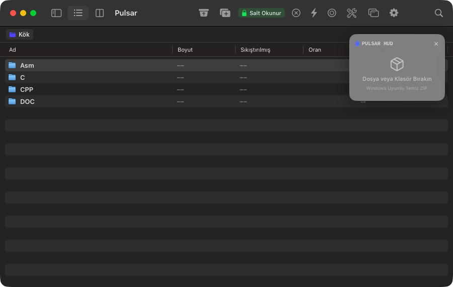 | 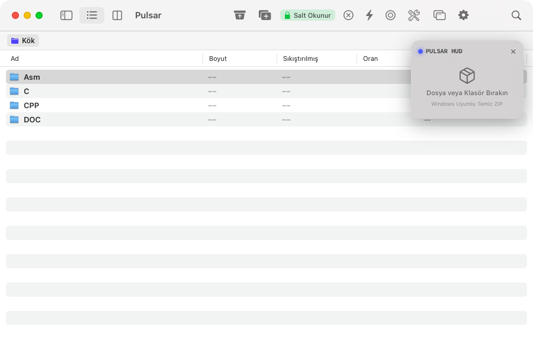 |
| **High Information Density View (Dark)** | **High Information Density View (Light)** |

### ⚙️ Settings Studio & Preferences (`⌘,`)

| Engines & Hardware Performance | Security, Keychain & Sandbox |
| :---: | :---: |
| 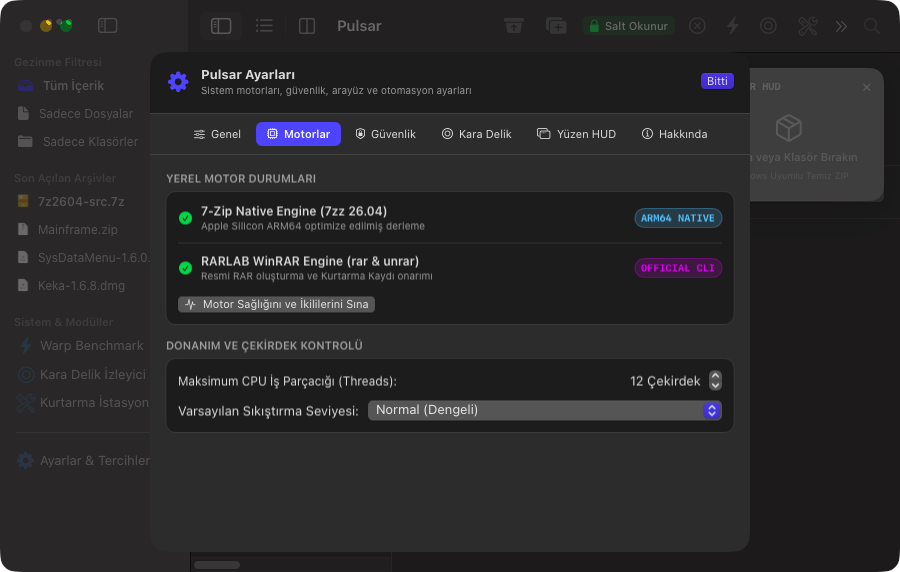 | 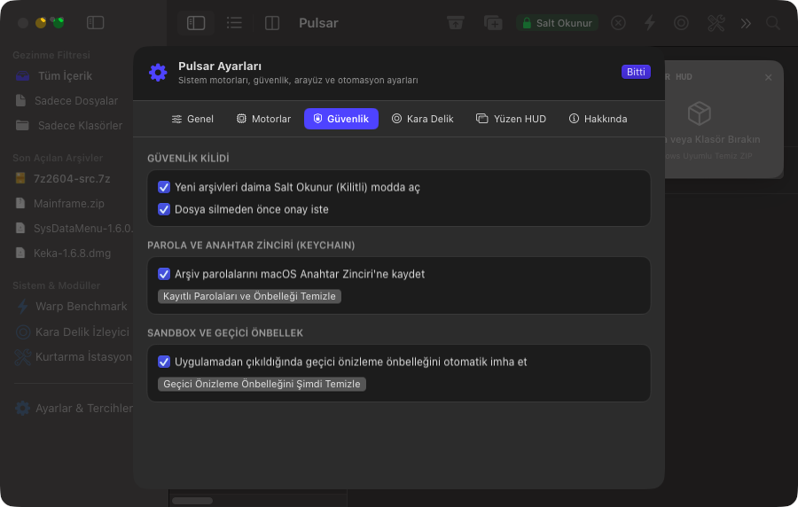 |
| **ARM64 Native Engine Diagnostics & Thread Allocation** | **Read-Only Lock & Apple Keychain Password Vault** |

### 📦 Compression Studio (`⌘N`) & Sci-Fi Modules

| Compression Studio (`⌘N`) | Hardware Warp Benchmark (`⌘⇧B`) |
| :---: | :---: |
| 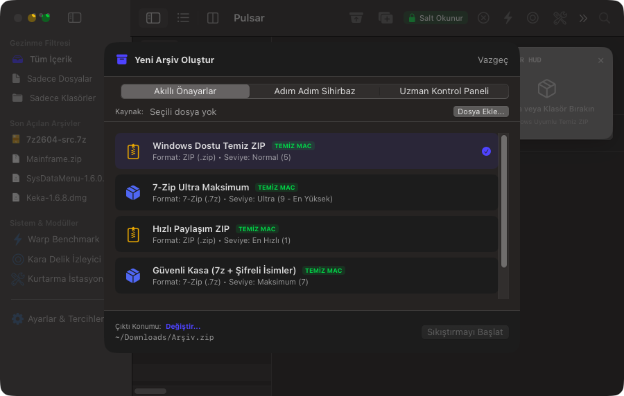 | 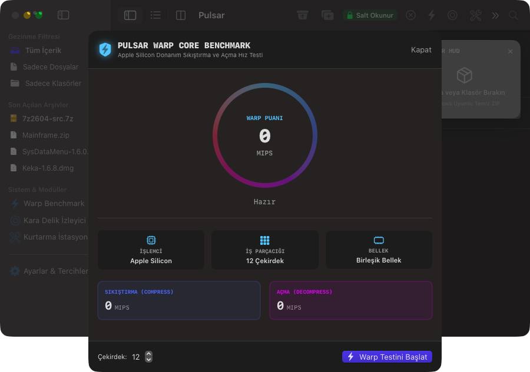 |
| **Smart Presets & Destination Picker** | **Apple Silicon Multithreaded MIPS Benchmark** |

| Black Hole Folder Watcher | Archive Repair Station |
| :---: | :---: |
| 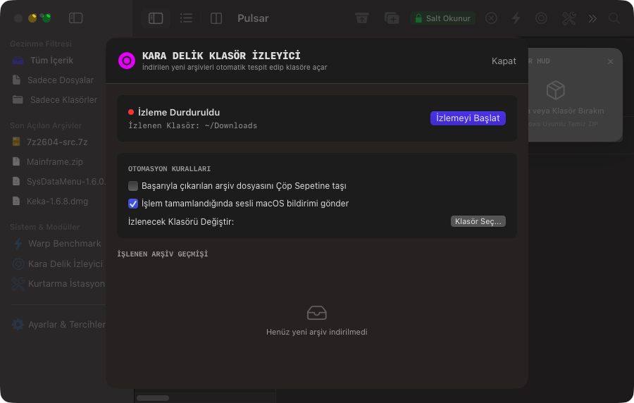 | 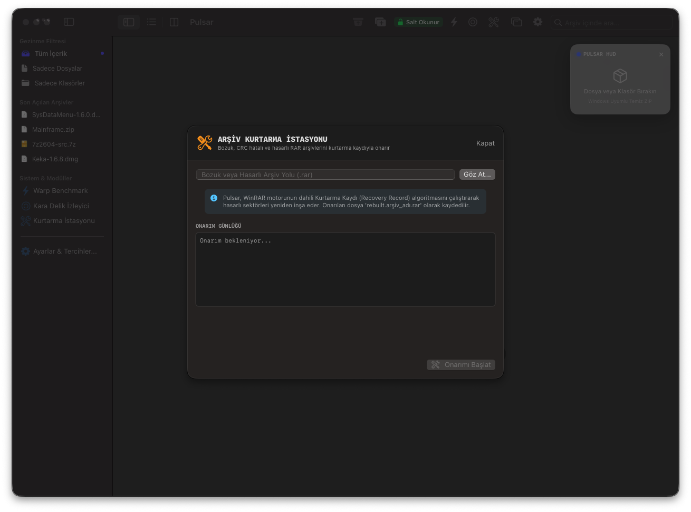 |
| **FSEvents Background Download Extractor** | **WinRAR Recovery Record Repair Station** |

---

### 1. Main Browser with 3 Switchable Layouts (`⌘1`, `⌘2`, `⌘3`)

Pulsar adapts to your workflow with three dedicated presentation modes:

* **Mode 1: Modern 3-Pane Layout (Inspector - `⌘1`)**:
  * **Sidebar:** Quick access to recently opened archives, favorites, and sci-fi system modules (Warp Benchmark, Black Hole, Repair Station).
  * **Browser (Center):** Interactive breadcrumbs for deep directory traversal, detailed table view showing name, compressed size, uncompressed size, compression ratio, and modification date. Double-click to traverse folders or preview files.
  * **Inspector (Right):** Live QuickLook preview pane, format badge, CRC32 checksum verification, file permissions, and instant action buttons (`Preview` / `Extract`).
* **Mode 2: Compact Classic List (Finder / WinRAR Style - `⌘2`)**:
  * Hides auxiliary sidebars to prioritize high information density. Perfect for power users scanning through archives with hundreds of files.
* **Mode 3: Tabbed Studio (`⌘3`)**:
  * Manage multiple open archives simultaneously across clean tabs. Effortlessly drag-and-drop files across tabs to copy between archives.

---

### 2. Dual-Mode Safe Lock UX (`⌘L`)

* **🔒 Read-Only Mode (Default)**: Prevents accidental archive corruption or unwanted modifications. Double-clicked files are unpacked into temporary isolated sandbox directories for safe viewing.
* **🔓 Live Edit Mode**: Activated via the toolbar lock button. Allows dragging new files directly into the active archive (`⌘N`), deleting items (`Delete`), or writing updated content back to the archive on the fly.

---

### 3. Floating Mini Widget (Floating HUD - `⌘⇧H`)

* A translucent, magnetic HUD card that can be docked to any screen corner or positioned freely.
* **Smart Drop-Zone:** Drag any file or folder from your desktop onto the widget to instantly compress it in the background using your active preset (default: Clean Windows ZIP).
* **Live Neutron Ring:** Visual circular progress ring, real-time MB/s throughput telemetry, and estimated time remaining (ETA).

---

### 4. Advanced Compression Studio & "Clean Mac" Filter

Three tailored levels of compression control:
1. **Smart Presets:** One-click presets for "Windows-Friendly Clean ZIP", "7-Zip Ultra Maximum", "Fast Share ZIP", and "RAR 100MB Multi-Volume".
2. **Step-by-Step Wizard:** 3-step guided flow (1. Format ➔ 2. Encryption & Passwords ➔ 3. Destination).
3. **Expert Control Panel:** Dictionary size, CPU thread allocation, solid block grouping, multi-volume splitting, and AES-256 encryption.
4. **Clean Mac Filter:** Automatically purges macOS metadata residues (`.DS_Store`, AppleDouble `._*`, `__MACOSX`) so archives shared with Windows users remain clean and junk-free.

---

### 5. Sci-Fi System Modules

#### ⚡ Pulsar Warp Core (Apple Silicon Benchmark - `⌘⇧B`)
Maxes out all Performance and Efficiency cores on your Apple Silicon chip (M1/M2/M3/M4 Pro/Max/Ultra). Runs native multithreaded 7-Zip benchmark routines to calculate real-time **MIPS** (Million Instructions Per Second) and data bandwidth, visualized via a circular sci-fi tachometer.

#### 🌌 Black Hole Folder Watcher
Monitors your `~/Downloads` directory via macOS `FSEvents`. Automatically extracts incoming `.zip`, `.rar`, `.7z`, and `.tar.gz` archives into organized destination folders, optionally moves source archives to Trash, and delivers native macOS notifications.

#### 🔧 Archive Repair Station
Scans damaged, CRC-mismatched, or incomplete RAR archives using WinRAR's built-in **Recovery Record** algorithms, reconstructing corrupted sectors into `rebuilt.filename.rar`.

---

## 🛡️ Stability & Security Safeguards

* **Anti-Hang Protection:** Subprocesses are detached from interactive STDIN pipes (`FileHandle.nullDevice`), preventing CLI tools from hanging indefinitely on prompts.
* **Instant Cancellation:** Real-time PID tracking in `SevenZipEngine` and `RAREngine` allows instant task termination and automatic cleanup of partial files.
* **Pre-Flight Disk Capacity Guard (`DiskSpaceGuard`):** Calculates volume headroom before extraction or compression, halting execution if available space is insufficient.
* **Sandbox Cache Lifecycle (`TempCacheManager`):** Guarantees zero disk residue by automatically purging temporary QuickLook preview folders on archive closure or application exit.

---

## 🌌 Universal Format Galaxy / Supported Formats

| Category | Supported Extensions | Engine | Capabilities |
| :--- | :--- | :--- | :--- |
| **Full Read & Write** | `.7z`, `.zip`, `.tar`, `.gz`, `.bz2`, `.xz` | 7-Zip ARM64 | AES-256, Solid Block, Multi-threading |
| **Official WinRAR** | `.rar` | WinRAR CLI | Creation, Extraction, Recovery Record Repair |
| **Next-Gen Speed** | `.zst`, `.zstd`, `.tzst`, `.lzma` | 7-Zip ARM64 | High-Speed Zstandard Decompression |
| **Packages & Images** | `.iso`, `.img`, `.dmg`, `.wim`, `.swm`, `.esd` | 7-Zip ARM64 | Disk Image Browsing & Extraction |
| **System & Distribution**| `.rpm`, `.deb`, `.cpio`, `.xar`, `.pkg` | 7-Zip ARM64 | Linux & macOS Package Inspection |
| **Legacy & Multi-Volume** | `.cab`, `.arj`, `.lzh`, `.lha`, `.chm`, `.001` | 7-Zip ARM64 | Split & Vintage Archive Extraction |

---

## ⌨️ Keyboard Shortcuts

| Shortcut | Action |
| :--- | :--- |
| `⌘1` | Modern 3-Pane Layout (Inspector) |
| `⌘2` | Compact List Layout |
| `⌘3` | Tabbed Studio Layout |
| `⌘,` | Settings Studio (Genel, Motorlar, Güvenlik, HUD, vb.) |
| `⌘⇧H` | Toggle Floating HUD Widget |
| `⌘L` | Toggle Safe Lock (Read-Only vs Live Edit) |
| `⌘N` | New Archive (Compression Studio) |
| `⌘O` | Open Archive |
| `⌘E` | Extract All Archive Contents |
| `⌘⇧B` | Launch Pulsar Warp Core Benchmark |
| `Space` | QuickLook File Preview |
| `Delete` | Delete Selected Item (When Edit Mode is active) |

---

## 🛠️ Build & Installation

### Requirements:
* macOS 14.0 (Sonoma) or macOS 15.0+ (Sequoia)
* Apple Silicon (M1/M2/M3/M4) architecture
* Swift 5.9+ / macOS Command Line Tools

### One-Command Build:
```bash
# 1. Clone repository
git clone https://github.com/mehmetsensoyme/pulsar.git
cd pulsar

# 2. Compile release application bundle (ad-hoc signed)
./Scripts/build.sh

# 3. Build DMG distribution image
./Scripts/package_dmg.sh
```

The compiled release will be available at `dist/Pulsar-1.2.2-arm64.dmg`.

### Running Automated Stability Tests:
```bash
./Scripts/run_tests.sh
```
Executes all built-in unit tests verifying format detection, encryption, disk safety guards, and cache purging.

---

## 🚀 GitHub Release & Deployment

1. **Pushing Changes:**
   ```bash
   git push -u origin main
   git push origin v1.2.2
   ```

2. **Automated CI/CD:**
   GitHub Actions workflows (`build-and-test.yml` and `release.yml`) automatically test builds and publish DMG artifacts upon tag creation.

3. **Promotional Landing Website (GitHub Pages):**
   * Go to repository **Settings ➔ Pages**.
   * Under **Build and deployment > Source**, select `Deploy from a branch`.
   * Choose **Branch:** `main` | **Folder:** `/Website` and click **Save**.
   * Your site will be live at `https://mehmetsensoyme.github.io/pulsar`.

---

## 📄 License & Credits

* Pulsar is distributed under the **MIT License**.
* Embedded 7-Zip (`7zz`) engine is developed by Igor Pavlov under the GNU LGPL.
* Official RAR / UnRAR binaries are property of Alexander Roshal / RARLAB.
